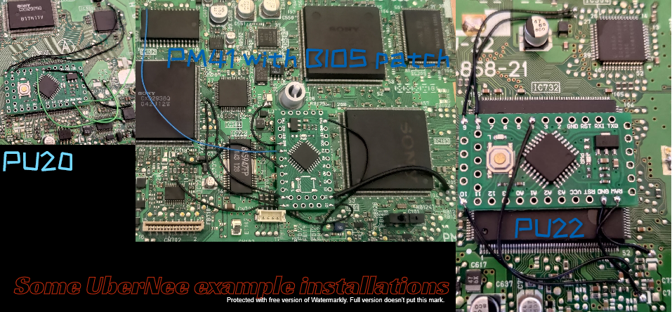

╔╗░╔╦══╗╔═══╦═══╦═══╦╗░╔╦══╦═══╗░░░░░░░░░░░░░░░░░░░░░░░░░
║║░║║╔╗║║╔══╣╔═╗║╔═╗║║░║╠╣╠╣╔═╗║░░░░░░░░░░░░░░░░░░░░░░░░░
║║░║║╚╝╚╣╚══╣╚═╝║║░╚╣╚═╝║║║║╚═╝║░░░░░░░░░░░░░░░░░░░░░░░░░
║║░║║╔═╗║╔══╣╔╗╔╣║░╔╣╔═╗║║║║╔══╝░░░░░░░░░░░░░░░░░░░░░░░░░
║╚═╝║╚═╝║╚══╣║║╚╣╚═╝║║░║╠╣╠╣║░░░░░░░░░░░░░░░░░░░░░░░░░░░░
╚═══╩═══╩═══╩╝╚═╩═══╩╝░╚╩══╩╝░░░░░░░░░░░░░░░░░░░░░░░░░░░░

# UberChip / UberNee

## Description

What got me super interested in modchips? Besides being the first mod I ever installed when I was 14 years old with a cheap iron from a local store?

This article: http://www.oldcrows.net/mcc2.html

I've read it quite a few times.

Though softmods are gaining popularity with the many available such as UniRom, Tonyhax (and it's forks, like Tonyhax international) & PS1 stealth unlocker - nothing beats a hardmod. With a hard mod you get the euphoric boot up with the white screen , followed by the black and the game just boots straight up! 

You don't need to start the console with the lid open, you don't need save exploits, you don't need to enter the memory card manager and wait for a load up.

UberChip was started from scratch as a timing based stealth chip - though being timing based, it was probably 99% stealth due to the different 
checks, performed at different times for different anti-mod titles.

As I learned more about PS1 modchips from various versions of UberChip I slowly progressed onto writing UberNee, which is based off PSNEE V7.
This offers a 100% stealth chip with multi-disc support. Though UberNee was started on Arduino Nano's with a 168/328P MCU, they became expensive
at one stage and I moved coding across to the LGT8F328P MCU - these are obtainable for an *extremely* low cost.

## Installation

The SUBQ data and SUBQ clock points are the same as PSNEE across all revisions.
Example installations folder in the UberNee directory should have you mostly covered. 
I like to use the opposite side of the cap on revisions where the Data line / SCEx are soldered to a capacitor (or somewhere on that trace). 
This should help tidy up the signal a little.

## Usage

Supports all PS1 revisions - there is also a mostly working region unlocker for PIC12F675 for JP models, though Uber-D-D chip (timing based)
would also work for these JP systems. I haven't gotten around to re-writing the PIC12F675 version in PIC-ASM to use the SCEI region string.

PAL PM41 (PSOne) region unlocking is included in UberNee! It uses the reverse engineered 'onechip' method and is 100% reliable.

## Credits

Oldcrow, psxdev & creel for his PIC programming youtube video

## License

Check the license included the root directory.

## How to Contribute

If you have time to reverse engineer PSNEE V8's JP region unlocking methods, feel free to send me the signal analysis and wiring or even update the code yourself. Just need wiring and timing - there are plenty of spare IO pins to use.

The idea of UberNee, besides being an updated PSNEE V7 (It differs in many ways) is the user friendly aspect. There's a full ISP flashing guide
where required and you'll see that making changes in the INO is dead simple. You only need to change some code attributes to a simple 'yes' / 'no' and
select your consoles region string.

There is nothing complicated about creating an UberNee chip from scratch.

-VajSkids

